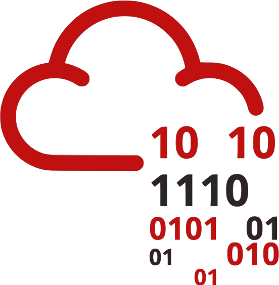

# Portfolio

# Hey, I’m Brian Sutterfield! 👋🏻

## 🔴 Jr. Security Engineer: Red Team

## What I do:

Currently, I am helping to build a Red Team at the Indiana Office of Technology from the ground up. We are in the process of creating a Pentesting program by designing the format for how we will perform Web Application, Internal/External Network, and Physical Pentests.

## Who I am:

I am a hardworking individual with a passion to protect and defend the personal information of others through hardening networks and actively testing them for vulnerabilities. Most people have either seen or been the victim of a malicious attack to some degree or another. I strive to teach my family and friends how to better secure their identities and home offices or networks to prevent these things from happening as much as possible. An avid learner, I work hard to stay up-to-date on the latest security trends and technologies to help maintain my expertise in the field. I am also passionate about sharing knowledge with my team and finding better ways to make technical knowledge more accessible to a non-technical audience.

## Experience At a Glance:

- Jr. Security Engineer at Indiana Office of Technology
- Penetration Tester Consultant for the State Earn and Learn Program: Employed by Brooksource, consultant at Indiana Office of Technology

[Projects](images/home/projects_all.csv)

## Education At a Glance:

- Bachelor’s of Science in Cybersecurity and Information Assurance From WGU
- CompTIA A+, Network+, Security+, CySA+, Pentest+, Linux+, and Project+
- ISC² Systems Security Certified Practitioner
- LPI Linux Essentials
- ITIL 4 Foundations
- Currently pursuing:
    - PNPT from TCM Security
    - BSCP From PortSwigger

---

Thanks for visiting! 🙏🏻

## Let’s Connect:

I enjoy chatting about cybersecurity, helping or participating in CTFs and other Cybersecurity related challenges, and generally just getting to know new people!

<aside>
 Email: BrianSutterfield@outlook.com

</aside>

<aside>
 [LinkedIn Profile](http://www.linkedin.com/in/brian-sutterfield3)

</aside>

<aside>
 [TryHackMe Profile](https://tryhackme.com/p/NfinityParad0x)

</aside>

<aside>
 [HackTheBox Profile](https://app.hackthebox.com/profile/582051)

</aside>
